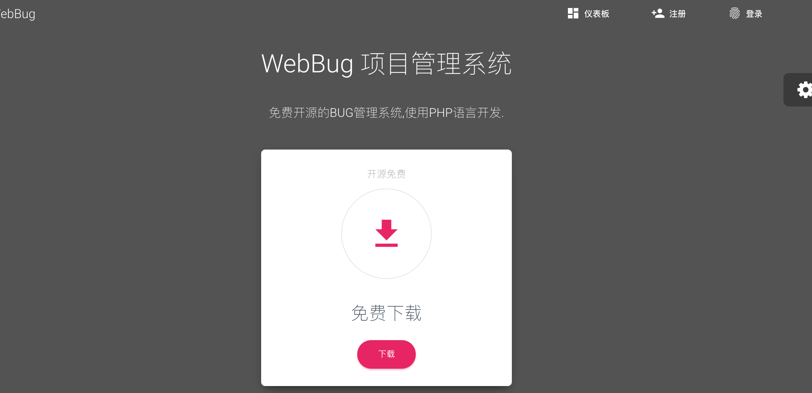

# WebBug 项目管理系统

 
   - git clone 
   - sh update-framework.sh
   - 安装数据库 resource/webbug.sql
   - 修改数据库配置 config/database.php
   - 复制.env.example到.env 修改数据库配置
   - 添加文件夹 public/static/upload 可写权限
   - 后台运行 php think queue:work  执行队列任务 发送通知邮件 可配合 supervisior 后台运行

